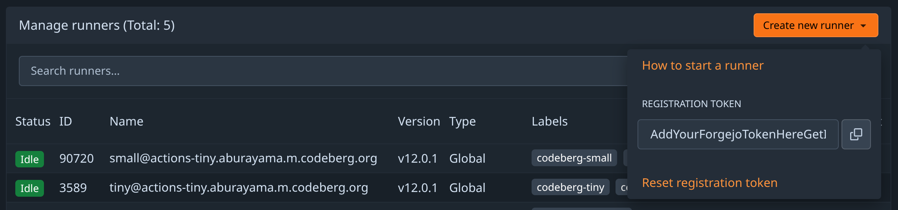
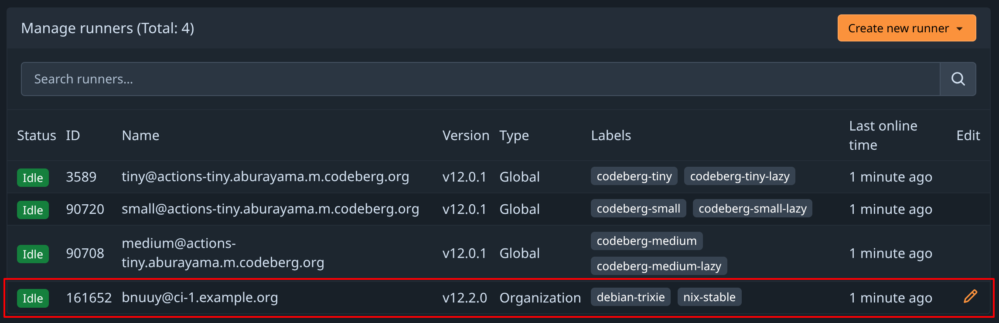

NixOS Forgejo Actions runner
============================

This repository contains a [NixOS] configuration for a dedicated [Forgejo Actions runner][runner] host running on a virtual private server.

Using it **does not require NixOS-specific knowledge or using Nix** in most cases. An experienced Linux user with no previous knowledge of NixOS should be able to deploy a Forgejo Actions runner from scratch in under 30 minutes using only the instructions in this README.

[nixos]: https://nixos.org/
[runner]: https://forgejo.org/docs/next/admin/actions/runner-installation/

> [!IMPORTANT]
> A Forgejo Actions runner may be configured in many different ways that subtly (or not so subtly) affect both how your CI workflows are run and how secure the resulting configuration is. This repository configures the Forgejo Actions runner to work with **podman**; as a result, there is no `docker` command available for CI workflows to use. While other configurations like **Docker-in-Docker** are possible, to our best knowledge it is not possible to secure such configurations without making unfounded assumptions about the types of CI workflows being run, and so they will not be provided here.


System requirements
-------------------

You will need a suitable VPS. Recommended system specifications:

  * Intel or AMD64 architecture;
  * 2 or more CPU cores;
  * 4 GB or more RAM;
  * 20 GB or more SSD space;
  * 100 Mbps or faster dual-stack (IPv4 plus IPv6) network.

A shared (non-dedicated) VPS with these specifications can cost less than €5 per month and be sufficient for many personal CI workloads.


Prerequisites
-------------

To use this repository, you will need a Linux, macOS, or Windows (WSL) system with `git`, `ssh`, and `rsync` installed. An existing Nix or NixOS installation is **not** required. Begin by cloning this repository:

```console
$ git clone https://codeberg.org/whitequark/nixos-forgejo-actions-runner
$ cd nixos-forgejo-actions-runner
```


Installation
------------

The configuration in this repository is suitable for deploying to any number of build hosts, where each deployment contains any number of Forgejo Actions runner instances.

> [!WARNING]
> While all reasonable effort has been taken to provide a secure deployment, isolation of CI jobs (confidentiality and integrity) depends on correctness of the Linux container implementation. While we expect that in most cases, CI jobs for different projects may share a build host using this configuration, it is recommended to use one build host per project if there are resources available to do so.

First, you will need a build host with NixOS installed. If you want to use this configuration with a VPS provider that does not offer NixOS as an option, pick Debian&nbsp;13&nbsp;(trixie) and then use the [nixos-bite] tool to convert it to NixOS. This repository make certain assumptions about the virtual hardware:

[nixos-bite]: https://codeberg.org/whitequark/nixos-bite

  * The root filesystem is ext4 and its label is `root` (use `e2label /dev/xxx root` to change it if necessary);
  * **For an x86_64 UEFI machine:** the ESP filesystem is vfat and its label is `boot`;
  * **For an x86_64 BIOS machine:** the root filesystem contains `/boot` and the bootloader is installed in the MBR of `/dev/sda` or `/dev/vda` (whichever exists);
  * The network configuration is static and known in advance;
  * IPv6-only, IPv4-only, and dual-stack networking is supported, including split-interface dual-stack.

If the nixos-bite tool succeeds and the machine is accessible via SSH after a reboot, then the build host satisfies these assumptions.

Once you can SSH into your new build host with NixOS running, create a configuration file `nixos/site/HOSTNAME.toml` for it, where `HOSTNAME` is either the fully-qualified domain name like `ci-1.example.org` (recommended), or an IP address like `2001:db8::1`. The deployment will be fully determined by the `*.nix` files in this repository and the `*.toml` file you create.

Start by specifying the platform. The two supported platforms are `x86_64-linux` (Intel) and `arm64-linux` (ARM), however any architecture supported by NixOS and Linux is likely to work.

```toml
[host]
platform = "x86_64-linux"
```

Next, configure the network. While a dual-stack deployment is recommended, omitting either the `net.ipv6` or `net.ipv4` section will result in an IPv4-only or IPv6-only deployment respectively. The IP addresses below are for documentation purposes only and should be replaced by actual addresses allocated to VPS.

```toml
[net.ipv6]
address = "2001:db8::1/64"
gateway = "fe80::1"

[net.ipv4]
address = "192.0.2.10/24"
gateway = "192.0.2.1"
```

The DNS configuration below, using [Quad9] servers with all filtering disabled, may be used as-is:

[quad9]: https://quad9.net/

```toml
[dns]
servers = ["2620:fe::10", "9.9.9.10"]
```

Specify the public keys of every user that should be able to access the build host. Ideally, keep this group as small as reasonably feasible. Anybody whose key is included here will be able to log in as `root`.

```toml
[ssh]
pubkeys = [
  "ssh-ed25519 AAAAAAAAAAAAAAAAAAAAAAAAAAAAAAAAAAAAAAAAAAAAAAAAAAAAAAAAAAAAAAAAAAAA username",
]
```

Finally, configure each of the Forgejo Actions runner instances you need. If this configuration is for your personal use only, e.g. to avoid resource limits placed by a forge like [Codeberg], you will likely use only one instance. In more complex cases, such as if you manage multiple Forgejo organizations or use multiple forges, you will need to use one instance per forge and Forgejo user or organization.

[Codeberg]: https://codeberg.org/

> [!WARNING]
> While all reasonable effort has been taken to provide a secure deployment, isolation of CI jobs (confidentiality and integrity) depends on correctness of the Linux container implementation. While we expect that in most cases, CI jobs for different projects may share a build host using this configuration, it is recommended to use one build host per project if there are resources available to do so.

```toml
[runners.bnuuy]
forge = "https://codeberg.org"
token = "AddYourForgejoTokenHereGetItFromTheForge"
labels = [
  "debian-trixie:docker://node:24-trixie",
  "nix-stable:docker://nixos/nix:2.32.0",
]
```

  * The `NAME` in `[runners.NAME]` is an identifier of your choice. It has no special significance, but will be visible in the Forgejo Actions settings once your instance is online.
  * The `forge` key should contain the base URL of the forge.
  * The `token` key should contain the "registration token" provided by the forge under Settings ‣ Actions ‣ Runners: 
  * The meaning of the `labels` key is [explained in the Forgejo Actions administrator guide](https://forgejo.org/docs/next/admin/actions/#choosing-labels).

To configure multiple runners, include several `[runners.NAME]` sections with distinct `NAME`s.

Finally, run `./scripts/deploy.sh HOSTNAME`. After a few minutes, you should see your new Forgejo Actions runner instance appear in the Forgejo interface under Settings ‣ Actions ‣ Runners:




Modification and updates
------------------------

After updating the build host configuration file, run `./scripts/deploy.sh HOSTNAME` again. Once the command completes successfully, the build host will match the updated configuration.

This repository will be kept up to date with NixOS releases. To apply such an update, run `git pull https://codeberg.org/whitequark/nixos-forgejo-actions-runner main` and then `./scripts/deploy.sh HOSTNAME` for each of your build hosts.


Troubleshooting
---------------

If something goes wrong, log into the build host using `ssh root@HOSTNAME` and examine its state. Many common diagnostic utilities will be preinstalled; if not, running `nix-shell -p PACKAGE` opens a shell with the corresponding [Nixpkgs] package installed.

[nixpkgs]: https://search.nixos.org/packages


Recovering from mistakes
------------------------

It is possible to make the build host inaccessible or unusable by entering incorrect network configuration or omitting your SSH public key from the list. Recovering from this state is easy if you have KVM access or can otherwise interact with the bootloader:

1. Reboot the machine.
2. Wait for a "NixOS ... GNU GRUB" screen to appear.
3. Select "NixOS - All configrations".
4. Select the second item in the list.


Support
-------

This repository and README are provided "as is" and it is not reasonably feasible to offer technical support to everyone experiencing difficulties with it. However, if you were able to solve your problem and concluded that this guide was unclear or lacking, or there was an issue with the NixOS configuration, please [file an issue](https://codeberg.org/whitequark/nixos-forgejo-actions-runner/issues) or [open a pull request](https://codeberg.org/whitequark/nixos-forgejo-actions-runner/pulls) so that it can be improved.

> [!TIP]
> Debugging Forgejo Actions runner issues did not spark joy.


License
-------

[0-clause BSD](LICENSE-0BSD.txt)
